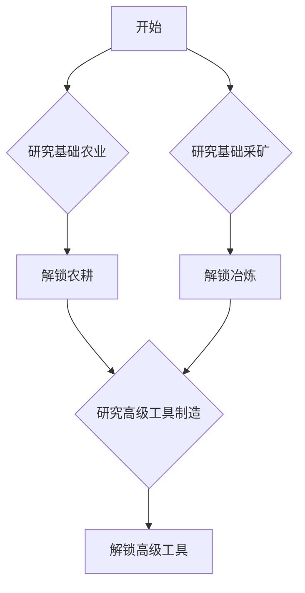
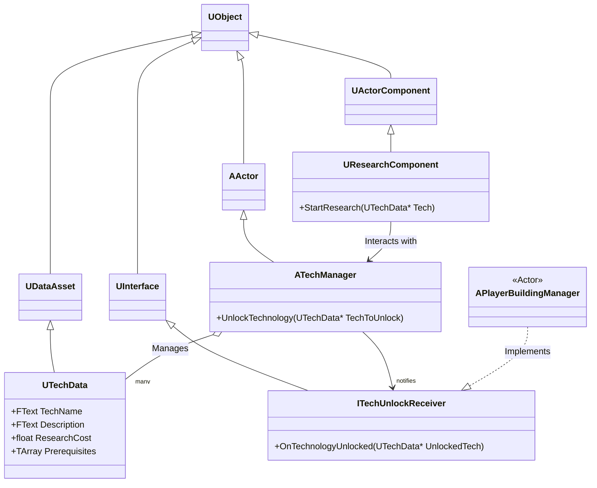

# 科技系统设计

本文档概述了游戏科技系统的基本设计。

## 科技树流程图

下面的流程图说明了技术的依赖关系和进展。

```mermaid
graph TD
    A[开始] --> B{研究基础农业};
    B --> C[解锁农耕];
    A --> D{研究基础采矿};
    D --> E[解锁冶炼];
    C --> F{研究高级工具制造};
    E --> F;
    F --> G[解锁高级工具];
```

## UE5 实现方案

我们采用以数据资产为核心、接口驱动的模块化设计，以适应UE5的开发模式。

```mermaid
classDiagram
    class UObject
    class UDataAsset
    class UInterface
    class AActor
    class UActorComponent

    UObject <|-- UDataAsset
    UObject <|-- UInterface
    UObject <|-- AActor
    UObject <|-- UActorComponent

    UDataAsset <|-- UTechData
    UTechData : +FText TechName
    UTechData : +FText Description
    UTechData : +float ResearchCost
    UTechData : +TArray<UTechData*> Prerequisites

    UInterface <|-- ITechUnlockReceiver
    ITechUnlockReceiver : +OnTechnologyUnlocked(UTechData* UnlockedTech)

    AActor <|-- ATechManager
    ATechManager : +UnlockTechnology(UTechData* TechToUnlock)
    ATechManager o-- "many" UTechData : Manages
    ATechManager --> "notifies" ITechUnlockReceiver

    UActorComponent <|-- UResearchComponent
    UResearchComponent : +StartResearch(UTechData* Tech)
    UResearchComponent --> ATechManager : Interacts with

    class APlayerBuildingManager {
        <<Actor>>
    }
    APlayerBuildingManager ..|> ITechUnlockReceiver : Implements
```