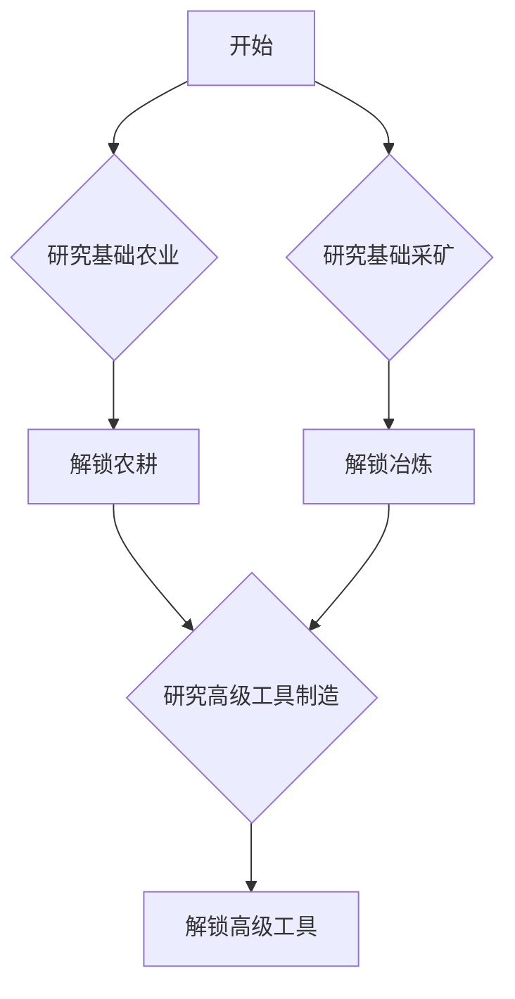

# 科技系统设计

本文档概述了游戏科技系统的基本设计。

## 科技树流程图

下面的流程图说明了技术的依赖关系和进展。



## UE5 最终实现方案

基于讨论，我们确定了以下更具体、模块化和可扩展的方案，重点关注了数据驱动、状态管理、持久化和UI分离。

```mermaid
classDiagram
    direction LR
    
    package "Data Assets (策划配置)" {
        class UDataAsset
        UDataAsset <|-- UTechData
        UDataAsset <|-- UTechTreeAsset

        UTechData : +FName TechID
        UTechData : +FText DisplayName
        UTechData : +FVector2D TreePosition
        UTechData : +TSoftObjectPtr<UTexture2D> Icon
        UTechData : +TArray<UTechData*> Prerequisites
        
        UTechTreeAsset : +TArray<UTechData*> AllTechnologies
    }

    package "Runtime (游戏运行时)" {
        class AActor
        class UActorComponent
        class UObject
        
        UObject <|-- UTechSaveGame : (存档对象)
        AActor <|-- ATechManager
        UActorComponent <|-- UResearchComponent

        ATechManager : +UTechTreeAsset* ActiveTechTree
        ATechManager : +TMap<FName, FTechProgress> TechStates
        ATechManager : +IsTechnologyUnlocked(FName TechID) bool
        ATechManager : +SaveToString() FString
        ATechManager : +LoadFromString(FString Data)
        ATechManager o-- UTechTreeAsset : "Uses"
        
        UResearchComponent : +StartResearch(UTechData* Tech)
        UResearchComponent --> ATechManager : "Updates"

        UTechSaveGame : +TMap<FName, FTechProgress> SavedTechStates
    }
    
    package "Interfaces (解耦)" {
        class UInterface
        UInterface <|-- ITechUnlockReceiver
        ITechUnlockReceiver : +OnTechnologyUnlocked(UTechData* UnlockedTech)
    }

    package "UI (可视化)" {
        class UUserWidget
        UUserWidget <|-- UI_TechTree
        UI_TechTree : "Visualizes"
        UI_TechTree ..> ATechManager : "Reads data from"
    }

    ATechManager --> ITechUnlockReceiver : "Notifies"
```
