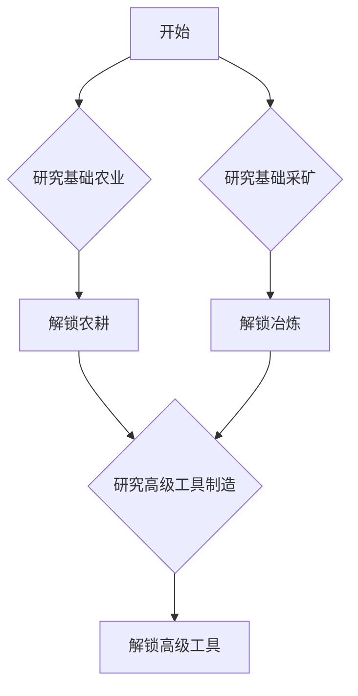
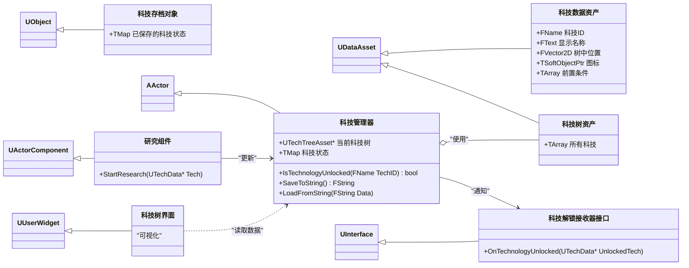

# 科技系统设计

本文档概述了游戏科技系统的基本设计。

## 科技树流程图

下面的流程图说明了技术的依赖关系和进展。

```mermaid
graph TD
    A[开始] --> B{研究基础农业};
    B --> C[解锁农耕];
    A --> D{研究基础采矿};
    D --> E[解锁冶炼];
    C --> F{研究高级工具制造};
    E --> F;
    F --> G[解锁高级工具];
```

## UE5 最终实现方案

基于讨论，我们确定了以下更具体、模块化和可扩展的方案，重点关注了数据驱动、状态管理、持久化和UI分离。

```mermaid
classDiagram
    direction LR

    UDataAsset <|-- 科技数据资产
    UDataAsset <|-- 科技树资产

    科技数据资产 : +FName 科技ID
    科技数据资产 : +FText 显示名称
    科技数据资产 : +FVector2D 树中位置
    科技数据资产 : +TSoftObjectPtr<UTexture2D> 图标
    科技数据资产 : +TArray<UTechData*> 前置条件
    
    科技树资产 : +TArray<UTechData*> 所有科技

    UObject <|-- 科技存档对象
    AActor <|-- 科技管理器
    UActorComponent <|-- 研究组件

    科技管理器 : +UTechTreeAsset* 当前科技树
    科技管理器 : +TMap<FName, FTechProgress> 科技状态
    科技管理器 : +IsTechnologyUnlocked(FName TechID) bool
    科技管理器 : +SaveToString() FString
    科技管理器 : +LoadFromString(FString Data)
    科技管理器 o-- 科技树资产 : "使用"
    
    研究组件 : +StartResearch(UTechData* Tech)
    研究组件 --> 科技管理器 : "更新"

    科技存档对象 : +TMap<FName, FTechProgress> 已保存的科技状态
    
    UInterface <|-- 科技解锁接收器接口
    科技解锁接收器接口 : +OnTechnologyUnlocked(UTechData* UnlockedTech)

    UUserWidget <|-- 科技树界面
    科技树界面 : "可视化"
    科技树界面 ..> 科技管理器 : "读取数据"

    科技管理器 --> 科技解锁接收器接口 : "通知"
```