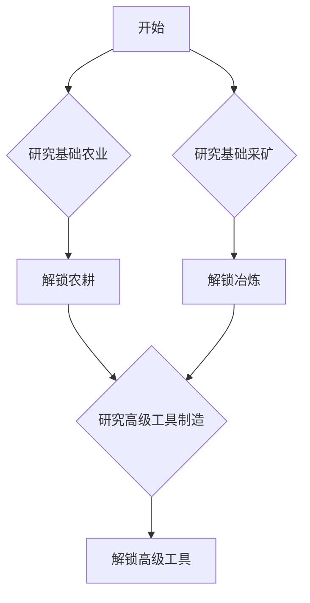

# 科技系统设计

本文档概述了游戏科技系统的基本设计。

## 科技树流程图

下面的流程图说明了技术的依赖关系和进展。

```mermaid
graph TD
    A[开始] --> B{研究基础农业};
    B --> C[解锁农耕];
    A --> D{研究基础采矿};
    D --> E[解锁冶炼];
    C --> F{研究高级工具制造};
    E --> F;
    F --> G[解锁高级工具];
```
